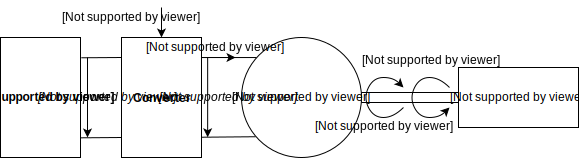
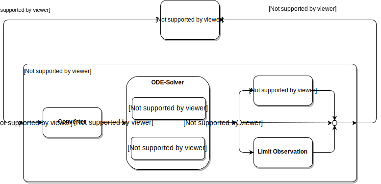

[](https://travis-ci.org/upb-lea/gym-electric-motor)
[](https://codecov.io/gh/upb-lea/gym-electric-motor)
[](https://pypi.python.org/pypi/gym-electric-motor/)
[](https://github.com/upb-lea/gym-electric-motor/blob/master/LICENSE)

__The gym-electric-motor (GEM) package is a software toolbox for the
simulation of
different electric motors.__ 

The toolbox is built upon the [OpenAI Gym Environments](https://gym.openai.com/) for reinforcement learning. 
Therefore, the toolbox is specifically designed for running reinforcement 
learning algorithms to train agents controlling electric motors.

[Read the detailed docs!](https://upb-lea.github.io/gym-electric-motor/)

So far, several DC-motor models and the three-phase motors permanent magnet synchronous motor (PMSM), 
synchronous reluctance motor (SynRM), squirrel cage induction motor (SCIM) and doubly-fed induction 
motor (DFIM) are available.
Beside electrical motors, also converters and load models are implemented. The converters can be driven by means of a duty cycle (continuous mode) or 
switching commands (discrete mode). 
The figure shows the basic scheme of the converter, motor and load. 
### Physical Structure of the Environment's Components

### Control Flow of a Step Cycle of the Environment 


### Citation
A whitepaper for this framework is available under [arxiv.org/abs/1910.09434
](https://arxiv.org/abs/1910.09434). Please use the following BibTeX entry for citing us:
```
@misc{traue2019reinforcement,
    title={Towards a Reinforcement Learning Environment Toolbox for Intelligent Electric Motor Control},
    author={Arne Traue and Gerrit Book and Wilhelm Kirchgässner and Oliver Wallscheid},
    year={2019},
    eprint={1910.09434},
    archivePrefix={arXiv},
    primaryClass={eess.SY}
}
```

### Installing

- Install gym-electric-motor from PyPI (recommended):

```
pip install gym-electric-motor
```

- Install from Github source:

```
git clone git@github.com:upb-lea/gym-electric-motor.git 
cd gym-electric-motor
# Then either
python setup.py install
# or alternatively
pip install -e .
```
### Authors
* Praneeth Balakrishna
* Gerrit Book
* Wilhelm Kirchgässner
* Maximilian Schenke
* Arne Traue
* Oliver Wallscheid

### Getting started
Like every gym environment, the basic user interface consists of four main functions.
* `import gym_electric_motor as gem`  
    Import of the package. 

* `env = gem.make(environment-id, **kwargs)`  
    Returns an instantiated motor environment. Call this function at the beginning.
    The `gem.make()` method is equal to the `gym.make()`. By using `gem.make()`you can avoid importing gym additionally. 
 
* `(initial_state, initial_reference) = env.reset()`  
    Resets the motor. This includes a new initial state and new reference trajectories.
    Call this function before a new episode starts. 

* `(state, reference), reward, done, _ = env.step(action)`      
    Simulate one single time step on the motor with an action.
    Call this function iteratively until termination is reached.

* `env.render()`    
    Update the visualization of the motor states.

### GEM Make Call
The make function takes the environment-ids and several constructor arguments.
Every environment also works without further parameters with default values.
These default parameters can be looked up in the API-documentation of every GEM-environment.
With the environment-id you select a certain motor type and action type (continuous or discrete) and with the further 
constructor arguments you can parametrize the environment to your control problem.

##### Environment Ids

* DC Motors

    * `'DcExtExCont-v1'`     
        Externally excited DC motor with continuous actions.
     
    * `'DcExtExDisc-v1'`   
        Externally excited DC motor with discrete actions.
    
    * `'DcPermExCont-v1'`    
        Permanently excited DC motor with continuous actions.
    
    * `'DcPermexDisc-v1'`    
        Permanently excited DC motor with discrete actions.
    
    * `'DcShuntCont-v1'`    
        DC shunt motor with continuous actions.
    
    * `'DcShuntDisc-v1'`    
        DC shunt motor with discrete actions.
    
    * `'DcSeriesCont-v1'`    
        DC series motor with continuous actions.
    
    * `'DcSeriesDisc-v1'`  
        DC series motor with discrete actions.
        
* Synchronous Motors
    
    * `'PMSMCont-v1'`:  
        Permanent magnet synchronous motor with continuous actions.
    
    * `'PMSMDisc-v1'`:  
        Permanent magnet synchronous motor with discrete actions.
        
    * `'SynRMCont-v1'`:  
        Synchronous reluctance motor with continuous actions.
    
    * `'SynRMDisc-v1'`:  
        Synchronous reluctance motor with discrete actions.
        
* Induction Motors

    * `'SCIMCont-v1'`:  
        Squirrel cage induction motor with continuous actions.
        
    * `'SCIMDisc-v1'`:  
        Squirrel cage induction motor with discrete actions.
        
    * `'DFIMCont-v1'`:  
        Doubly fed induction motor with continuous actions.
        
    * `'DFIMDisc-v1'`:  
        Doubly fed induction motor with discrete actions.
        
#### Make Keyword-Arguments
Using the keyword arguments in the `gem.make(id, **kwargs)` function you can select different function modules for the 
environment and parametrize these modules. 
The main level modules of each GEM-environment consists of four function modules:

* Physical System
    * keyword: `physical_system`
    * Specification and simulation of the system model.
* Reference Generator
    * keyword: `reference_generator`
    * Generation of references that the physical system has to follow.
* Reward Function
    * keyword: `reward_function`
    * Reward calculation based on the current state and reference.
* Visualization    
    * keyword: `visualization`
    * Visualization of the physical systems state, reference and rewards.
* State Filter
    * keyword: `state_filter`
    * Selection of states that shall be shown to the agent.
    
These function modules can be selected in three ways:

* Passing a keystring (and further keyword arguments for the class) :
     * `reference_generator='SinusoidalReference', amplitude_range=(0.2, 0.8)`

* Passing a class pointer (and further keyword arguments for the class)
    * `reference_generator=SinusoidalReferenceGenerator, amplitude_range=(0.2,0.8)`

* Passing an instantiated object
  * `reference_generator = SinusoidalReferenceGenerator(amplitude_range=(0.2,0.8)`
      
Furthermore, the internal function modules of the physical systems like the converter, motor, load can be selected in
the make keyword-arguments in the same way. 

The available modules and specific keyword-arguments for each module can be looked up in the API-documentation.
### Reset
The reset function determines new references, new initial values and resets the visualization.
Call this function before a new episode begins.
The parameters of the motor, converter and load will be those during instantiation.

### Step
This function performs one action on the environment for one time step.
It simulates the motor and needs to be called in every time step. It takes the action as parameter only.
First the input voltage to the motor from the converter is determined and afterwards an integrator is used to compute 
the next state. 
Eventually, the reward is evaluated and returned together with the next observation and a flag indicating termination.
Several reward functions are available.

### Render
The visualization contains graphs of the motor quantities 'speed, voltages, currents, torque' for one episode. 
What should be shown is to be specified in the configuration-parameter.
The quantities that should be displayed can be specified in the constructor-parameters.
All visualizations are optional and recommended to be disabled for increased speed of training.

### Examples

- Conventional PI controller as speed controller on a dc series motor [(jump to source)](examples/pi_series_omega_control.py).

- Training and testing of a [Keras-rl](https://github.com/keras-rl/keras-rl) DDPG-Agent as a speed controller on a dc series motor [(jump to source)](examples/ddpg_series_omega_control.py).
 
### Physical System Models
The following electrical motor , converter and mechanical load models are included. More detailed descriptions can be found in the corresponding classes.
 
##### Motor Models
The following motor models are included:

Four DC motors:

- permanently excited motor
- externally excited motor
- series motor
- shunt motor

Two three phase motors:

- PMSM (permanent magnet synchronous motor)
- SynRM (synchronous reluctance motor)

Two variants of the induction motor:

- SCIM (squirrel cage induction motor)
- DFIM (doubly fed induction motor)

##### Converter
Following converters are included:

- 1 quadrant converter (1QC)

- 2 quadrant converter (2QC) as an asymmetric half bridge with both current polarities

- 4 quadrant converter (4QC)

- B6 Bridge Converter (B6C)

All converters can consider interlocking times and a dead time of one sampling interval.
Furthermore, they can be controlled with a discrete action space or a continuous action space.

Discrete actions are the direct switching states of the transistors.
Continuous actions are the duty cycles for a pulse width modulation on the transistors. 

##### Load
The load model consists of a quadratic load function, with user defined coefficients. 
Furthermore the moment of inertia of the load attached to the motor can be specified.

### Notes about the states and value ranges
The included states for each motor are summarized and briefly described in the [Motor Dashboard](visualizations/motor_dashboard.html).
Every state that can be plotted can also be used in the state filter or as observed state.
The actions are basically understood as the desired duty cycles. The actual applied voltage can be taken from the observations.
The observations are normalized to their physical limits that can be accessed with `env.limits`.
Therefore, all values are typically in a range of [0, 1] or [-1, 1] without limit violation.


### Notes about the Parameters
All nominal values of voltages and currents are DC values in the case of a DC motor and peak phase values for the PMSM.
Therefore, data sheet values for line voltage and phase currents of a PMSM has to be transformed with:


Furthermore, the angular velocity is the mechanical one and not the electrical: 


The mechanical one is needed for speed controller.
The included angle is the electrical one due to its usage in the rotational transformation for three phase motors.


### Running Unit Tests with Pytest
To run the unit tests ''pytest'' is required.
All tests can be found in the ''tests'' folder.
Execute pytest in the project's root folder:
```
>>> pytest
```
or with test coverage:
```
>>> pytest --cov=./
```
All tests shall pass.
