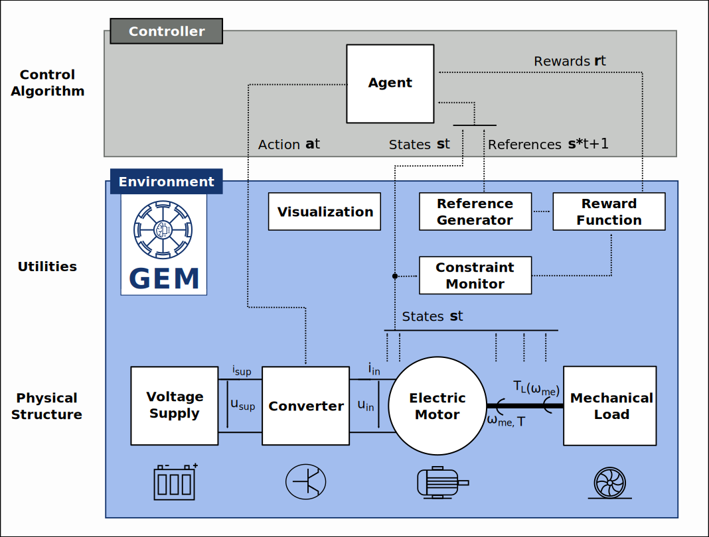

# Gym Electric Motor


[**Paper**](https://arxiv.org/abs/1910.09434)
| [**Quickstart**](#getting-started)
| [**Install guide**](#installation)
| [**Reference docs**](https://upb-lea.github.io/gym-electric-motor/)
| [**Release notes**](https://github.com/upb-lea/gym-electric-motor/releases)

[](https://travis-ci.org/upb-lea/gym-electric-motor)
[](https://codecov.io/gh/upb-lea/gym-electric-motor)
[](https://pypi.python.org/pypi/gym-electric-motor/)
[](https://github.com/upb-lea/gym-electric-motor/blob/master/LICENSE)

## Overview
The gym-electric-motor (GEM) package is a Python toolbox for the simulation and control of various electric motors.

It is built upon [OpenAI Gym Environments](https://gym.openai.com/), and, therefore, can be used for both, classical control simulation and reinforcement learning experiments. It allows you to construct a typical drive train with the usual building blocks, i.e. supply voltages, converters, electric motors and load models, and obtain not only a closed-loop simulation of this physical structure, but also a rich interface for plugging in any decision making algorithm, from PI-controllers to [Deep Deterministic Policy Gradient](https://spinningup.openai.com/en/latest/algorithms/ddpg.html) agents.

## Getting Started
An easy way to get started with GEM is by playing around with the following interactive notebooks in Google Colaboratory. Most important features of GEM as well as application demonstrations are showcased, and give a kickstart for engineers in industry and academia.


There is a list of [standalone example scripts](examples/) as well for minimalistic demonstrations.

A basic routine is as simple as:
```py
import gym_electric_motor as gem

if __name__ == '__main__':
    env = gem.make("PMSMDisc-v1")  # instantiate a discretely controlled PMSM
    env.reset()
    for _ in range(1000):
        env.render()  # visualize environment
        (states, references), rewards, done, _ =\ 
        	env.step(env.action_space.sample())  # pick random control actions
    env.close()
```


## Installation
- Install gym-electric-motor from PyPI (recommended):

```
pip install gym-electric-motor
```

- Install from Github source:

```
git clone git@github.com:upb-lea/gym-electric-motor.git 
cd gym-electric-motor
# Then either
python setup.py install
# or alternatively
pip install -e .
```

## Building Blocks
A GEM environment consists of following building blocks:
- Physical Structure:
   - Supply Voltage
   - Converter
   - Electric motor
   - Load Model
- Utility functions for reference generation, reward calculation and visualization
 
### Information Flow in a GEM Environment


Among various DC-motor models, the following three-phase motors - together with their power electronic counterparts - are available:
- Permanent Magnet Synchronous Motor (PMSM), 
- Synchronous Reluctance Motor (SynRM)
- Squirrel Cage Induction Motor (SCIM)
- Doubly-fed Induction Motor (DFIM)

The converters can be driven by means of a duty cycle (continuous mode) or switching commands (discrete mode). 

### Citation
A whitepaper for this framework is available under [arxiv.org/abs/1910.09434](https://arxiv.org/abs/1910.09434). Please use the following BibTeX entry for citing us:
```
@misc{traue2019reinforcement,
    title={Towards a Reinforcement Learning Environment Toolbox for Intelligent Electric Motor Control},
    author={Arne Traue and Gerrit Book and Wilhelm Kirchgässner and Oliver Wallscheid},
    year={2019},
    eprint={1910.09434},
    archivePrefix={arXiv},
    primaryClass={eess.SY}
}
```

### Running Unit Tests with Pytest
To run the unit tests ''pytest'' is required.
All tests can be found in the ''tests'' folder.
Execute pytest in the project's root folder:
```
>>> pytest
```
or with test coverage:
```
>>> pytest --cov=./
```
All tests shall pass.
