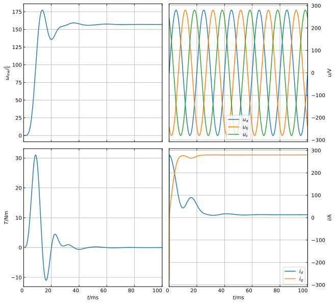

# Summary

The ``gym-electric-motor`` (``GEM``) library provides simulation environments for 
electrical drive systems, and therefore allows to easily design and analyze drive control
solutions in Python. Since ``GEM`` is strongly inspired by OpenAI's ``gym`` [@gym-whitepaper], it 
is particulary well-equipped for (but not limited to) applications in the field of 
reinforcement-learning-based control algorithms. The API allows to apply changes
the motor parametrization to e.g. simulate a specific motor or configure
the desired load behavior.

# Field of Application

Electric drive systems are an important topic both in academic and 
industrial research due to the worldwide availability and deployment of such 
plants. Control algorithms for these systems have usually been designed, parametrized and 
tested within [``MATLAB - Simulink``](https://www.mathworks.com/products/matlab.html), which is developed and marketed specifically for
such engineering tasks. In the more recent past, however, commercial software like
``MATLAB`` has difficulties to stay on par with the expandability and flexibility offered 
by open-source libraries that are available for more accessible programming languages like Python. 
Moreover, the latest efforts concerning industrial application of reinforcement-learning control 
algorithms heavily depend on Python packages like ``Keras`` [@Chollet2015] or ``Tensorflow`` [@tensorflow2015-whitepaper]. 
To allow easy access to a drive simulation environment, the ``GEM`` library has been developed.

# Package Architecture

The ``GEM`` library models an electric drive system by it's four main components: voltage supply, power converter, 
electric motor and mechanical load. The general structure of such a system is depicted in Fig. \autoref{fig:SCML_system}. 

The __voltage supply__ provides for the necessary power that is used by the motor. 
It is modeled by a fixed supply voltage $u_{sup}$, which allows to monitor the supply current into the converter.
A __converter__ is needed to supply the motor with electric power of proper frequency and magnitude, 
which may also include the conversion of the direct current from the supply to alternating 
current. Typical drive converters have switching behavior: there is a finite set of
different voltages that can be applied to the motor, depending on which switches are open and which are closed. 
Besides this physically accurate view, a popular modelling approach for switched mode converters
is based on dynamic averaging of the applied voltage $u_{in}$, making the voltage a continuous variable.
Both of these modelling approaches are implemented and can be chosen freely,
allowing usage of control algorithms that operate on a finite set of switching states or on continuous input voltages.
The __electric motor__ is the centerpiece of every drive system. It is modelled by a system of ordinary differential 
equations (ODEs) which represent the electrical behavior of the motor itself. Particularly the domain of three-phase drives
makes use of coordinate transformations to view these ODEs in a more interpretable frame. In ``GEM``, both, 
the physical ($abc$-) and the simplified ($dq$-)coordinates are available to be used as the frame of input 
and output variables, allowing for easy and quick controller analysis and diagnose within the most convenient 
coordinate frame. Finally, the torque $T$ resulting from the motor is applied to the __mechanical load__. 
It is characterized by a moment of inertia and by a load torque $T_L$ that is directed against the motor torque. 
Load torque behavior can be parametrized with respect to the angular velocity $\omega_{me}$ in the form of constant,
linear and quadratic dependency (and arbitrary combinations thereof). Speed changes that result from the difference 
between motor and load torque are modelled with another ODE which completely covers the mechanical system behavior.
Alternatively, the motor speed can be set to a fixed value, which can be useful for the investigation of control
algorithms concerning generatoric operation. 

# Features

A large number of different motor systems is already implemented. These include DC drives as well as
synchronous and induction three-phase drives. A complete list can be viewed in the ``GEM`` documentation [@GEM-docu].
The corresponding power converters allow to control the motor either directly via applied voltage (continuous-control-set)
or by defining the converter's switching state (finite-control-set). Specifically for the use within reinforcement-learning
applications, the toolbox comes with a built-in reference generator, which can be used to create trajectories of 
reference operational points (e.g. for the motor current, velocity or torque). These generated references are furthermore
used to calculate a reward. In the domain of reinforcement-learning, reward is the optimization variable that is to be 
maximized. For the control system scenario, reward is usually defined by the negative distance between the momentary 
operation point and the desired operation point, 
such that expedient controller behavior can be monitored easily. The metric by which
the distance of two operational points is measured, can be adjusted to the users desire. The reward mechanism
also allows to take physical limitations of the drive system into account, e.g. in the way of a notably low reward
if limit values are surpassed. Optionally, the environment can be setup such that a reset of the system
is demanded in case of a limit violation.

# Examples

A minimal example of ``GEM's`` simulation capability is presented in Fig. \autoref{fig:SCIM_example}.
The plot shows the start-up behavior of a squirrel cage induction motor connected to a rigid network
concerning angular velocity $\omega_\mathrm{me}$, torque $T$, voltage $u_{a,b,c}$ and current $i_{d,q}$.
Here, the voltage is depicted within the physical $abc$-frame while the current is viewed within the 
simplified $dq$-frame. 

Exemplary code snippets that demonstrate the usage of ``GEM`` are included 
within the projects repository:
- [ddpg_pmsm_dq_current_control](https://github.com/upb-lea/gym-electric-motor/blob/master/examples/ddpg_pmsm_dq_current_control.py): a reinforcement-learning control approach applied to the current control of a permanent magnet synchronous motor within the $dq$-frame 
- [ddpg_series_omega_control](https://github.com/upb-lea/gym-electric-motor/blob/master/examples/ddpg_series_omega_control.py): a reinforcement-learning control approach applied to the speed control of a series motor
- [dqn_series_current_control](https://github.com/upb-lea/gym-electric-motor/blob/master/examples/dqn_series_current_control.py): a reinforcement-learning control approach for finite-control-set voltage control of a series motor
- [pi_series_omega_control](https://github.com/upb-lea/gym-electric-motor/blob/master/examples/pi_series_omega_control.py): a conventional control algorithm applied to the speed control of a series motor

# References