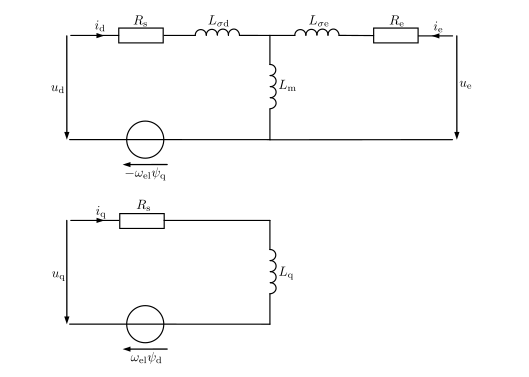

Extertnally Excited Synchronous Motor
######################################

Schematic
*********

.. math:: 

    L_{\sigma \mathrm{d}} &= L_\mathrm{d} - L_\mathrm{m} \\
    L_{\sigma \mathrm{e}} &= L_\mathrm{e} - L_\mathrm{m} \\
    \psi_\mathrm{d} &= L_\mathrm{d} i_\mathrm{sd} + L_\mathrm{m} i_\mathrm{e} \\
    \psi_\mathrm{q} &= L_\mathrm{q} i_\mathrm{sq} 

Electrical ODE
**************

.. math::
    \sigma = \frac{L_\mathrm{d} L_\mathrm{e} - L_\mathrm{m}^2}{L_\mathrm{d} L_\mathrm{e}}

.. math::
    \frac{\mathrm{d} i_\mathrm{sd}}{\mathrm{d} t} &= - \frac{ R_\mathrm{s} }{ \sigma L_{\mathrm{d} } } i_\mathrm{sd} + \frac{L_\mathrm{q}}{\sigma L_\mathrm{d}} p \omega_\mathrm{me} i_\mathrm{sq} + \frac{L_\mathrm{m} R_\mathrm{e}}{\sigma L_\mathrm{d} L_\mathrm{e}} i_\mathrm{e} + \frac{1}{\sigma L_\mathrm{d}} u_\mathrm{d} - \frac{L_\mathrm{m}}{\sigma L_\mathrm{d} L_\mathrm{e}} u_\mathrm{e} \\
    \frac{\mathrm{d} i_\mathrm{sq}}{\mathrm{d} t} &= -\frac{L_\mathrm{d}}{L_\mathrm{q}} p \omega_\mathrm{me} i_\mathrm{sd} - \frac{R_\mathrm{s}}{L_\mathrm{q}} i_\mathrm{sq} - \frac{L_\mathrm{m}}{L_\mathrm{q}} p \omega_\mathrm{me} i_\mathrm{e} + \frac{1}{L_\mathrm{q}} u_\mathrm{q} \\
    \frac{\mathrm{d} i_\mathrm{e}}{\mathrm{d} t} &= \frac{L_\mathrm{m} R_\mathrm{s}}{\sigma L_\mathrm{d} L_\mathrm{e}} i_\mathrm{sd} - \frac{L_\mathrm{m} L_\mathrm{q}}{ \sigma L_\mathrm{d} L_\mathrm{e}} p \omega_\mathrm{me} i_\mathrm{sq} - \frac{R_\mathrm{s}}{ \sigma L_\mathrm{e}} i_\mathrm{e} - \frac{L_\mathrm{m}}{\sigma L_\mathrm{d}L_\mathrm{e}} u_\mathrm{d} + \frac{1}{\sigma L_\mathrm{e}} u_\mathrm{e}   \\
    \frac{\mathrm{d} \varepsilon_\mathrm{el}}{\mathrm{d} t} &= p \omega_\mathrm{me} \\

Torque Equation
***************

.. math::
    T = 1.5 p (L_\mathrm{m}  i_\mathrm{e} + (L_\mathrm{d} - L_\mathrm{q})  i_\mathrm{sd})  i_\mathrm{sq}

Code Documentation
******************

.. autoclass:: gym_electric_motor.physical_systems.electric_motors.ExternallyExcitedSynchronousMotor
   :members:
   :inherited-members:
