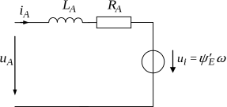

Permanently Excited DC Motor
#############################

Schematic
*********

Electrical ODE
**************

.. math::
    \frac{\mathrm{d} i}{\mathrm{d} t} &= \frac{u_\mathrm{a} - \mathit{\Psi}^\prime_\mathrm{e} \omega_\mathrm{me} - R_\mathrm{a} i}{L_\mathrm{a}} \\

Torque Equation
***************
.. math::
    T = \mathit{\Psi}_\mathrm{e} i

Code Documentation
******************

.. autoclass:: gym_electric_motor.physical_systems.electric_motors.DcPermanentlyExcitedMotor
   :members:
   :inherited-members:
