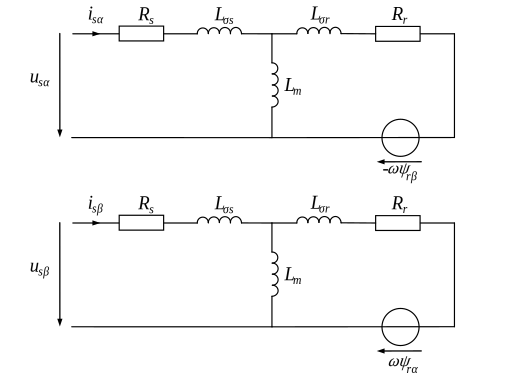

Squirrel Cage Induction Motor
##################################

Schematic
*********

Electrical ODE
**************

.. math::
    \frac{\mathrm{d} i_{s \alpha}}{\mathrm{d} t}&= -\frac{1}{\tau_\sigma} i_{s \alpha} + \frac{R_r L_m}{\sigma L_r^2 L_s} \psi_{r \alpha} + p \omega_{\text{me}} \frac{L_m}{\sigma L_r L_s}  \psi_{r \beta} + \frac{1}{\sigma L_s} u_{s \alpha}\\
    \frac{\mathrm{d} i_{s \beta}}{\mathrm{d} t}&= -\frac{1}{\tau_\sigma} i_{s \beta} - p \omega_{\text{me}} \frac{L_m}{\sigma L_r L_s}  \psi_{r \alpha}  + \frac{R_r L_m}{\sigma L_r^2 L_s} \psi_{r \beta} + \frac{1}{\sigma L_s} u_{s \beta}\\
    \frac{\mathrm{d} \psi_{r \alpha}}{\mathrm{d} t}&= \frac{L_m}{\tau_r} i_{s \alpha} - \frac{1}{\tau_r} \psi_{r \alpha} - p \omega_{\text{me}} \psi_{r \beta} \\
    \frac{\mathrm{d} \psi_{r \beta}}{\mathrm{d} t}&= \frac{L_m}{\tau_r} i_{s \beta} + p \omega_{\text{me}} \psi_{r \alpha} - \frac{1}{\tau_r} \psi_{r \beta} \\
    \frac{\mathrm{d} \varepsilon_{el}}{\mathrm{d} t}&= p \omega_{me}

with

.. math::
    L_s &= L_m + L_{\sigma s}, & L_r &= L_m + L_{\sigma r}\\
    \sigma &= \frac{L_r L_s - L_m^2}{L_r L_s}, & \tau_r &=\frac{L_r}{R_r}, & \tau_\sigma &= \frac{\sigma L_s}{R_s + R_r \frac{L_m^2}{L_r^2}}

Torque Equation
***************

.. math:: T=\frac{3}{2} p \frac{L_m}{L_r} (\psi_{r \alpha} i_{s \beta} - \psi_{r \beta} i_{s \alpha})

Code Documentation
******************

.. autoclass:: gym_electric_motor.physical_systems.electric_motors.SquirrelCageInductionMotor
   :members:
   :inherited-members: