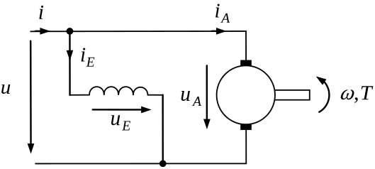

DC Shunt Motor
############################

Schematic
*********

Electrical ODE
**************

.. math::
    \frac{\mathrm{d} i_\mathrm{a}}{\mathrm{d} t} &= \frac{u - L_\mathrm{e}^\prime i_\mathrm{e} \omega_\mathrm{me} - R_\mathrm{a} i_\mathrm{a}}{L_\mathrm{a}} \\
    \frac{\mathrm{d} i_\mathrm{e}}{\mathrm{d} t} &= \frac{u - R_\mathrm{e} i_\mathrm{e}}{L_\mathrm{e}}

Torque Equation
***************
.. math::
    T = L_\mathrm{e}^\prime i_\mathrm{e} i_\mathrm{a}

Code Documentation
******************

.. autoclass:: gym_electric_motor.physical_systems.electric_motors.DcShuntMotor
   :members:
   :inherited-members:
