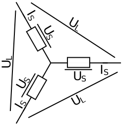

Technical Background
====================
The package contains different electric motors, power electronic converters and load models.
In this part the technical models are described and references to more detailed explanations are given.
All included electric motors can be represented by a system of differential equations and those are the same for the
continuous and discrete action case. The load model is the same in all cases.
The converters are shortly introduced. More detailed descriptions are included in each converter class, where also the
action space is specified.

The DC motors

- permanently excited
- externally excited
- series
- shunt

and the

- permanent magnet synchronous motor (PMSM)

are included. The figure below shows the basic structure of converter, motor and load that is modeled.

.. figure:: ../plots/FigureConvMotorLoad6.svg

Further information about electrical motor and power electronic converters can be found in [Boecker2018a]_, [Boecker2018b]_ and [Chiasson2005]_.

DC Motors
#########

Externally Excited Motor
------------------------
The figure shows the circuit diagram of this motor [Boecker2018a]_.

.. figure:: ../plots/ESBdcExtEx.svg

The equations are

:math:`u_A=\mathit{\Psi}^\prime_E \omega + L_A \frac{\mathrm{d} i_A}{\mathrm{d} t} +R_A i_A`

:math:`u_E=L_E \frac{\mathrm{d} i_E}{\mathrm{d} t} + R_E i_E`

:math:`\mathit{\Psi}^\prime_E=L^\prime_E i_E`

:math:`T=\mathit{\Psi}^\prime_E i_A`

:math:`\frac{\mathrm{d} \omega_{me}}{\mathrm{d} t}=\frac{T-T_L(\omega_{me})}{J}`

and can be rewritten as

:math:`\frac{\mathrm{d} i_A}{\mathrm{d} t}=\frac{u_A-L^\prime_E \omega i_E -R_A i_A}{L_A}`

:math:`\frac{\mathrm{d} i_E}{\mathrm{d} t}=\frac{u_E-R_E i_E}{L_E}`

:math:`\frac{\mathrm{d} \omega_{me}}{\mathrm{d} t}=\frac{L^\prime_E i_A i_E -T_L(\omega_{me})}{J}\text{.}`

For DC motors is :math:`\omega_{me}=\omega` valid.

The quantities for this and the other motors are:

- :math:`u_A` armature voltage

- :math:`u_E` excitation voltage

- :math:`i_A` armature current

- :math:`i_E` armature current

- :math:`R_A` armature resistance

- :math:`R_E` excitation resistance

- :math:`L_A` armature inductance

- :math:`L_E` excitation inductance

- :math:`\omega` (electrical) angular velocity

- :math:`\omega_{me}` mechanical angular velocity

- :math:`L^\prime_E` effective excitation inductance

- :math:`T` Torque produced by the motor

- :math:`T_L` Torque from the load

- :math:`J` moment of inertia

- :math:`\mathit{\Psi}^\prime_E` effective excitation flux

Other motors are build on this motor with different connections of armature and excitation circuit.

Series Motor
------------
In this type both circuits are in series connection, :math:`i=i_A=i_E` and :math:`u=u_A+u_E`,  as shown in the figure [Boecker2018a]_.

.. figure:: ../plots/ESBseries.svg

The equation for this motor are

:math:`\frac{\mathrm{d} i}{\mathrm{d} t}=-\frac{L^\prime_E}{L_A+L_E} i \omega -\frac{R_A+R_E}{L_A+L_E} i + \frac{1}{L_A+L_E} u`

:math:`\frac{\mathrm{d} \omega}{\mathrm{d} t}=\frac{L^\prime_E}{J} i^2-\frac{1}{J}T_L(\omega)`

The torque equation is the same as before.

Shunt Motor
-----------
In this type the circuits are connected in parallel, :math:`i=i_A+i_E` and :math:`u=u_A=u_E`,  as shown in the figure [Boecker2018a]_.

.. figure:: ../plots/ESBshunt.svg

The equation for this motor are

:math:`\frac{\mathrm{d} i_A}{\mathrm{d} t}=\frac{u-L^\prime_E \omega i_E -R_A i_A}{L_A}`

:math:`\frac{\mathrm{d} i_E}{\mathrm{d} t}=\frac{u-R_E i_E}{L_E}`

:math:`\frac{\mathrm{d} \omega}{\mathrm{d} t}=\frac{L^\prime_E i_A i_E -T_L(\omega)}{J}`

and the torque equation is the same as before.

Permanently Excited Motor
--------------------------
In this type the excitation :math:`\mathit{\Psi}^\prime_E` is constant and therefore it only contains the armature circuit of the
externally excited motor.

The equations are

:math:`\frac{\mathrm{d} i}{\mathrm{d} t}=\frac{u-\mathit{\Psi}^\prime_E \omega -R_A i}{L_A}`

:math:`\frac{\mathrm{d} \omega}{\mathrm{d} t}=\frac{L^\prime_E i^2 -T_L(\omega)}{J}`

Permanent Magnet Synchronous Motor (PMSM)
#########################################

The PMSM is a three phase motor with a permanent magnet in the rotor as shown in the figure [Boecker2018b]_. The input of this motor are
the voltages :math:`u_a`, :math:`u_b` and :math:`u_c`.

The quantities are:

- :math:`u_a`, :math:`u_b`, :math:`u_c` phase voltages

- :math:`i_a`, :math:`i_b`, :math:`i_c` phase currents

- :math:`R_s` stator resistance

- :math:`L_d` d-axis inductance

- :math:`L_q` q-axis inductance

- :math:`i_{sd}` d-axis current

- :math:`i_{sq}` q-axis current

- :math:`u_{sd}` d-axis voltage

- :math:`u_{sq}` q-axis voltage

- :math:`p` pole pair number

- :math:`\mathit{\Psi}_p` permanent linked rotor flux

- :math:`\epsilon` rotor position angle

- :math:`\omega` (electrical) angular velocity

- :math:`\omega_{me}` mechanical angular velocity

- :math:`T` Torque produced by the motor

- :math:`T_L` Torque from the load

- :math:`J` moment of inertia

The electrical angular velocity and the mechanical angular velocity are related such that :math:`\omega=\omega_{me} p`.

.. figure:: ../plots/GDAFig29.svg

The circuit diagram of the phases are similar to each other and the armature circuit of the externally excited motor.

.. figure:: ../plots/pmsmMotorB6.png

For an easy computation the three phases are first transformed to the quantities :math:`\alpha` and :math:`\beta` and
afterwards to :math:`d/q` coordinates that rotated with the rotor as given in [Boecker2018b]_.

.. figure:: ../plots/ESBdq.svg

This results in the equations:

:math:`u_{sd}=R_s i_{sd}+L_d \frac{\mathrm{d} i_{sd}}{\mathrm{d} t}-\omega_{me}p L_q i_{sq}`

:math:`u_{sq}=R_s i_{sq}+L_q \frac{\mathrm{d} i_{sq}}{\mathrm{d} t}+\omega_{me}p L_d i_{sd}+\omega_{me}p \mathit{\Psi}_p`

:math:`\frac{\mathrm{d} \omega_{me}}{\mathrm{d} t}=\frac{T-T_L(\omega_{me})}{J}`

:math:`T=\frac{3}{2} p (\mathit{\Psi}_p +(L_d-L_q)i_{sd}) i_{sq}`

A more detailed derivation can be found in
[Modeling and High-Performance Control of Electric Machines, John Chiasson (2005)]

The difference between rms and peak values and between line and phase quantities has to be considered at the PMSM.
The PMSM is in star conncetion and the line voltage :math:`U_L` is mostly given in data sheets as rms value.
In the toolbox the nominal value of the phase voltage :math:`\hat{U}_S=\sqrt{\frac{2}{3}}U_L` is needed.
Furthermore, the supply voltage is typically the same :math:`u_{sup}=\hat{U}_S`.
For example, a line voltage of :math:`U_L=400~\text{V}` is given, the rms phase voltage is :math:`U_S=\sqrt{\frac{1}{3}}U_L = 230.9 \text{ V}`
and the peak value :math:`\hat{U}_S=326.6 \text{ V}`.
The nominal peak current of a phase is given by :math:`\hat{I}_S=\sqrt{2} I_S`.

Converter
#########

The DC input voltage of the converter is named supply voltage :math:`u_{sup}` in the package and the output voltage and
current are the input quantities of the motor and therefore are named as :math:`u_{in}` and :math:`i_{in}`.
All converter contain a dead time of one sampling interval and an interlocking times can be considered.
More details can be found in [Boecker2018a]_, [Boecker2018b]_ and [Chiasson2005]_.

1 Quadrant Converter (1QC)
--------------------------
This converter can provide positive voltages and positive currents at the output [Boecker2018a]_.

:math:`u_{in} \geq 0`

:math:`i_{in} \geq 0`

.. figure:: ../plots/1QC.svg

2 Quadrant Converter (2QC)
--------------------------

This converter can provide positive voltages and both current directions at the output [Boecker2018a]_.

:math:`u_{in} \geq 0`

:math:`i_{in}` both signs

.. figure:: ../plots/2QCigbt.svg

4 Quadrant Converter (4QC)
--------------------------

This converter can provide both voltage and currents polarities at the output [Boecker2018a]_.

:math:`u_{in}` both signs

:math:`i_{in}` both signs

.. figure:: ../plots/4QC.svg

Three-Phase Voltage Source Inverter
-----------------------------------

This converter is also called B6 bridge and is used for three phase motors as the PMSM. The supply voltage is DC and it
consists of three parallel half bridges, one for each phase :math:`u_a`, :math:`u_b` and :math:`u_c`. Due to this 8
different switching states are possible. A dead time of one sampling time step and
interlocking times can be considered. A symmetric B6 bridge with a voltage range of :math:`[-u_{DC}/2,~+u_{DC}/2]` is used.
[Boecker2018b]_

.. figure:: ../plots/B6.svg

Load Models
###########

The package can deal with polynomial load equations

:math:`T_L(\omega_{me})=\mathrm{sign}(\omega_{me})(c \omega^2_{me} + b \vert\omega_{me}\vert + a)`.

Furthermore an additional moment of inertia :math:`J_{Load}` of the load can be set.

References
##########

.. [Boecker2018a] Böcker, Joachim; Elektrische Antriebstechnik; 2018; Paderborn University

.. [Boecker2018b] Böcker, Joachim; Controlled Three-Phase Drives; 2018; Paderborn University

.. [Chiasson2005] Chiasson, John; Modeling and High-Performance Control of Electric Machines; 2005; Hoboken, NJ, USA

